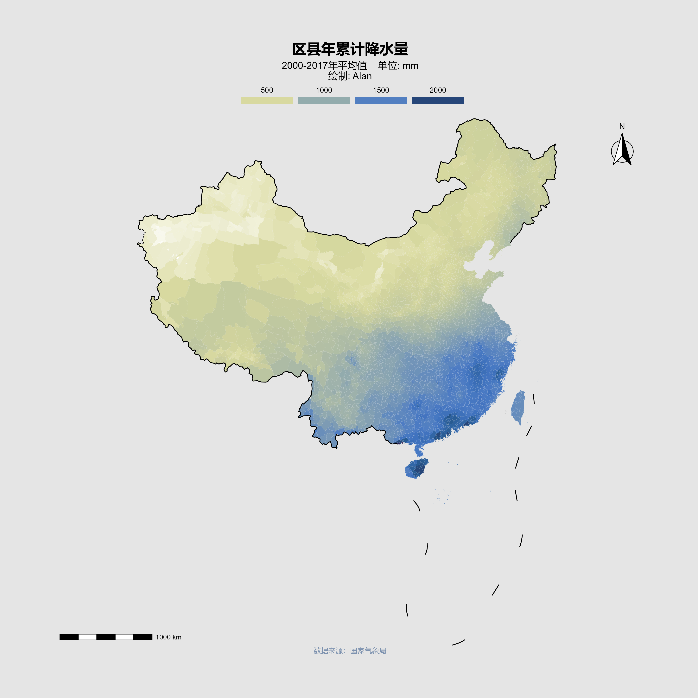
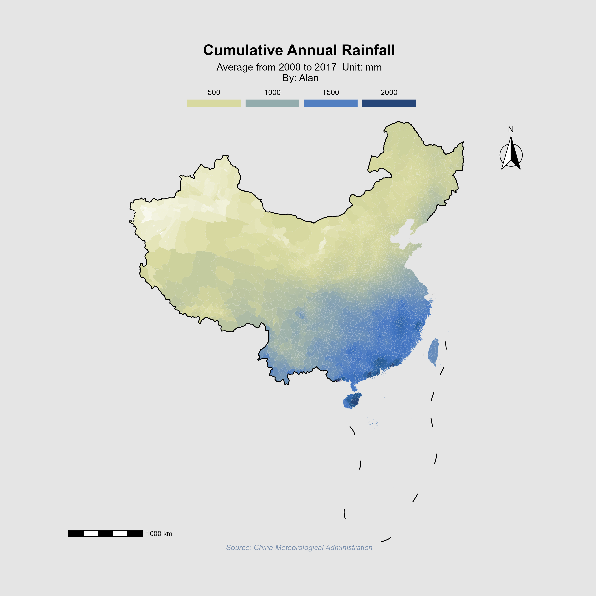
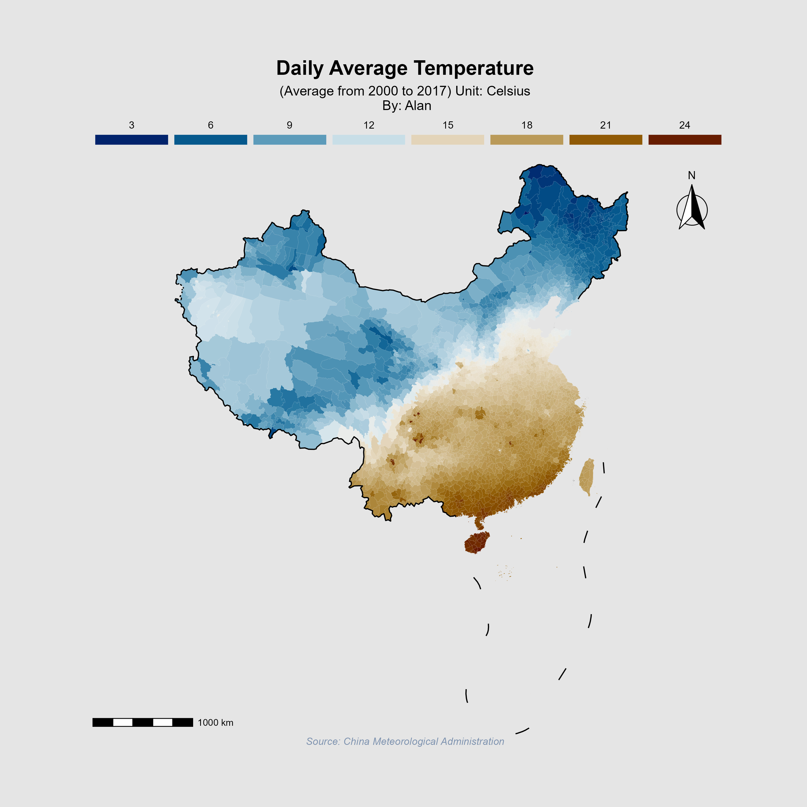
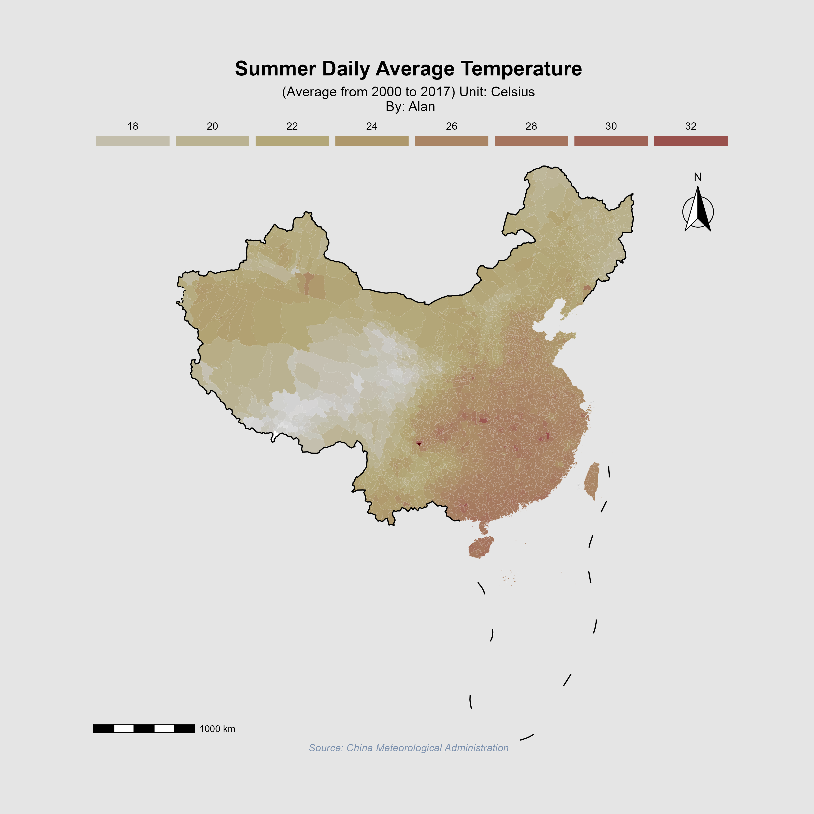

# Econ-GIS

This project is for construction, cleaning and graphing of Geographical data related to Econ field. Right now, I only use two kinds of data -- precipitation and temperature data from more than 2,000 weather stations (Source: China Meteorological Administration), and I hope to add more variables later on. The main languages I hope to use are ` R`, `Python` and `Stata`, since the first two are well-known to be data-driven and open source, `Stata` is a very powerful software to clean data. `ArcGIS` is kind of hard to do reproducible research (Although ArcPy and QGIS Python API are keeping up with the trend).

## Usage

I haven't thought of a good way to do intergration of these codes, like a workflow (Maybe a Stata or R package is a good way to go), so right now I only have raw codes, you can just run these on `Stata` , `R` or `RStudio`.

`Merge.do`: aggregate daily meteorological data (from 2000 to 2017) to monthly, quarterly, yearly data.

`IDW.R`: spatial interplation of weather station data to county data in China, use IDW method

`missing2final.do`: fill in missing data using neighboring counties' data

```bash
cd path_of_project
"C:\Program Files\Stata16\StataSE" /e do Merge.do
```

`Merge_for_panel.do`: aggregate daily meteorological data (from 2000 to 2017) to monthly, quarterly, yearly data by year.

## Demos









## References

https://www.stata.com/support/faqs/windows/batch-mode/

(Maybe there is a way to construct an alias `Stata` for Windows Stata's absolute path, so it's possible to do everything on the CLI, like in the MacOS.)

RStata Platform (In deep debt, help me understand about  `R` language, I adopt  graph theme)

https://mgimond.github.io/Spatial/interpolation-in-r.html

https://rspatial.org/raster/analysis/4-interpolation.html

https://r-spatial.org/r/2018/10/25/ggplot2-sf.html